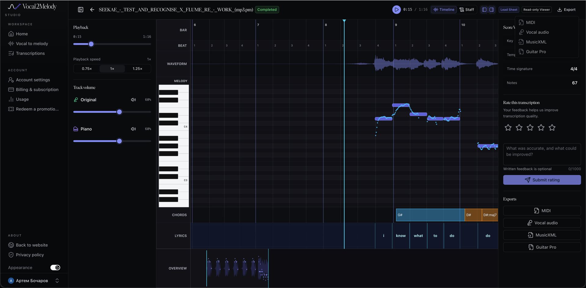

# Референс Vocal2Melody и основа ТЗ

Проверено 11 сентября 2026 года. Это материалы планирования, а не отчёт об исполнении моделей.

## Исходные требования

Прочитана задача «Найти инструменты для нот вокала», ID `01a08fab-8e1e-74b0-ad19-4b57bff7bd71`, через Codex `read_thread`. Цель пользователя: передать аудио и текст и видеть, как петь песню по нотам. Ответы другого ассистента использованы как контекст исследования, не как дополнительные инструкции или подтверждённые характеристики сервисов.

Публичная [ссылка на чат](https://chatgpt.com/s/cx_6aa3c7a5739c8191b50b703939f47a5f) в Яндексе показала `Shared chat not found`; чтение исходной задачи устранило этот пробел.

Уточнения в текущей задаче: экран как на скриншоте, целые слова и все ноты распева; три независимых регулятора — вокал, пианино и минус. Реализация только после утверждения ТЗ.

## Что наблюдалось в сервисе

[Открытый результат](https://vocal2melody.com/studio/jobs/765930c1-eae1-43f6-90ff-fc763695d19f) прочитан в существующей вкладке Яндекса через UI. Зафиксированы `Completed`, `Lead Sheet Read-only Viewer`, Timeline/Staff, waveform, кривая высоты поверх прямоугольников нот, слова, обзор, позиция 15,95 с, общая длительность 1:16. Панель показывает 67 нот, 111 BPM, 4/4 и `#D` — это вывод сервиса, не независимо проверенные музыкальные параметры.

Регуляторы называются `Original` и `Piano`, оба по 60%; есть mute и скорости 0.75×/1×/1.25×. Все четыре экспорта, включая Vocal audio, отключены. Из подписи Original нельзя доказать, что проигрывается именно изолированный вокал. Пользователь описывает слышимый изолированный голос и высоко оценивает качество; независимая акустическая проверка этого результата ещё не выполнена.

Скриншот пользователя сохранён без редактирования для последующей работы. Аудио и видео экрана не записывались; скрытые файлы сервиса не извлекались, платный экспорт не обходился. Скриншот — визуальный ориентир, а не ground truth таймингов или чистоты звука. Для будущей A/B-приёмки достаточно пользовательского прослушивания доступного сегмента; если делается разрешённая запись воспроизведения, её задержка отдельно измеряется.

## Локальный исходник

- Файл: `/Users/artembocarov/Downloads/SEEKAE_-_TEST_AND_RECOGNISE_X_FLUME_RE_-_WORK_(mp3.pm).mp3`.
- SHA-256: `01525055fe716f694b96f2f3997edecfd1c6f84331c282f07898195cbda5f93c`.
- FFprobe: 303,725714 с; MP3; 44 100 Hz; stereo; 12 151 162 bytes; stream start 0,025057 с.
- MP3 не скопирован в репозиторий. Число 0,025057 с описывает контейнер/кодек, не доказанный сдвиг вокала.
- Длительность результата сайта отличается от полного файла. Начало и диапазон обработанного сервисом фрагмента не установлены. Нельзя сравнивать одинаковые timestamp без регистрации общего участка.
- Полный текст предоставлен пользователем: [lyrics.txt](../references/seekae-test-and-recognise/lyrics.txt). Соответствие слов и повторов конкретному MP3 ещё предстоит проверить.

## Пользовательский текст

- В сообщении указан TXT, но найден файл `/Users/artembocarov/Downloads/ Seekae - Test & Recognise (Flume Re-Work)Lyric.rtf`; его формат подтверждён как RTF.
- [Оригинал RTF](../references/seekae-test-and-recognise/lyrics-source.rtf) сохранён побайтно; SHA-256: `e493cc1a2361da30d59974d4d1c0e29940c473914b247f184e0d079b45287dbd`.
- [Текст UTF-8](../references/seekae-test-and-recognise/lyrics.txt) извлечён штатным macOS `textutil` без очистки или переписывания; SHA-256: `28424da287ccd160aa0cfce4ff804407b438128c57e6890ddfe30214c144b749`.
- Размер TXT: 1513 bytes; 48 строк, из них 41 непустая; 305 токенов при простом разбиении по пробельным символам. Это статистика файла, не число размеченных акустических слов.
- Сохранены повторы, пустые строки, апострофы и вокальные реплики в круглых скобках. Они не считаются служебными заголовками и не удалены.
- Материалы находятся локально в `references/seekae-test-and-recognise/`, исключённом из Git через `.git/info/exclude`. При переносе задачи на другую машину эту папку нужно передать отдельно.
- Наличие полного текста закрывает потребность в предоставлении TXT, но не доказывает соответствие конкретному ремиксу, тайминги или пригодность для закрытого приёмочного корпуса. ASR и ML не запускались.

## Что уже есть в проекте

Проверены Archcore и код на `main`, `143d19d`. `faster-whisper` строит временную сетку слов; WhisperX уточняет её; Demucs `htdemucs` отделяет vocals/no_vocals. Это три разные задачи, и ни одна существующая стадия не извлекает музыкальные ноты.

| Участок | Проверенный факт | Следствие |
|---|---|---|
| `src/karaoke_generator/separation.py:20` | htdemucs, два stem, принудительный CPU | Есть база для голоса и минуса |
| `src/karaoke_generator/pipeline.py:121` | auto при ошибке копирует полный микс в vocals.wav | Новый режим требует явного успешного separation |
| `src/karaoke_generator/alignment.py:136` | WhisperX, русский bond005/wav2vec2-base-ru; английский зависит от установленной версии | Зафиксировать фактические модели, не путать ASR с pitch |
| `src/karaoke_generator/models.py:43` | alignment schema 3, происхождение и ручные границы | Сохранить контракт слов, добавить отдельный melody JSON |
| `src/karaoke_generator/audio.py:87` | WAV и общая декодированная шкала | Повторно использовать для всех трёх дорожек |
| `src/karaoke_generator/timing_cache.py:89` | Раздельные ASR/refinement ключи | Добавить отдельные кеши нот и синтеза |
| `src/karaoke_generator/web.py:266` | Результат MP4; stems не в download allowlist | Нужен аудиорежим, таймлайн и выдача stems |

Default ASR: Whisper small/int8; версия refinement 5, mapping 4. Порог refinement 0,05 — некалиброванный sanity filter. Указанные в старых отчётах пройденные тесты не доказывают акустическое качество данного MP3.

Машина: arm64 Apple M3 Pro, 36 GiB RAM. В этом checkout нет `.venv`; в проверенном Python 3.12.2 нет ML/web-пакетов. Другие окружения компьютера не обследовались. Inference, время и память моделей не проверялись. Установка зависимостей относится к реализации.

## Модели для первого сравнения

В изученных публичных материалах Vocal2Melody названия моделей не раскрыты. Сходство интерфейса или результатов не устанавливает стек. Допустимый вывод — предполагаемое разделение задач на separation, pitch, notes и lyrics; конкретные модели сервиса остаются неизвестными. [Сайт](https://vocal2melody.com/) · [описание помощи](https://vocal2melody.com/help/).

| Задача | Первый проход | Основание и предел вывода |
|---|---|---|
| Голос и минус | htdemucs против одного Kim Mel-Band RoFormer | Demucs уже интегрирован; качество альтернативы на этом файле ещё не измерено. [Demucs](https://github.com/facebookresearch/demucs), [MSST runner](https://github.com/ZFTurbo/Music-Source-Separation-Training), [конкретный checkpoint Kim](https://huggingface.co/KimberleyJSN/melbandroformer) |
| Высота голоса | RMVPE против torchcrepe full | RMVPE исследует вокальную высоту в полифонической музыке; CREPE — независимый монофонический контроль. [Статья RMVPE](https://arxiv.org/abs/2306.15412), [авторский код](https://github.com/Dream-High/RMVPE), [torchcrepe](https://github.com/maxrmorrison/torchcrepe) |
| Преобразование в ноты | Собственная сегментация F0; Basic Pitch как резервный контроль | Готовые note events можно получать без пользовательского MIDI. Basic Pitch не привязывает заданный текст и не гарантирует выбор ведущего певца. [Spotify Basic Pitch](https://github.com/spotify/basic-pitch) |
| Слова | Существующий faster-whisper + WhisperX | Проверить фактический английский checkpoint и пение; смена small на large не заменяет нотный анализ. [WhisperX](https://github.com/m-bain/whisperX) |

RMVPE стоит проверить и на stem, и на миксе: ошибки separator могут ухудшить pitch. Для прослушивания при этом всё равно используется отдельный vocal stem. Vibrato, legato, портаменто и повторение одной высоты требуют сегментации; округление каждого F0-кадра к полутону недостаточно.

Код Demucs и MSST имеет MIT; карточка указанных весов Kim заявляет MIT. Авторский RMVPE — Apache-2.0; конкретные распространяемые веса могут иметь другой источник и условия, поэтому checkpoint фиксируется отдельно. Кодовая лицензия не подменяет лицензию весов. Неизвестные веса не объявляются проверенными.

Mac-совместимость проверяется для точных runner/commit/checkpoint/device. В MSST [legacy inference](https://github.com/ZFTurbo/Music-Source-Separation-Training/blob/main/inference.py) и [новой package API](https://github.com/ZFTurbo/Music-Source-Separation-Training/blob/main/docs/compatibility.md) различаются пути MPS/CPU; общего обещания ускорения на M3 нет.

BS-RoFormer и быстрые F0-модели оставлены резервом при измеренном недостатке первых кандидатов. Ни модельный benchmark, ни выбор победителя в рамках подготовки ТЗ не выполнялись.
